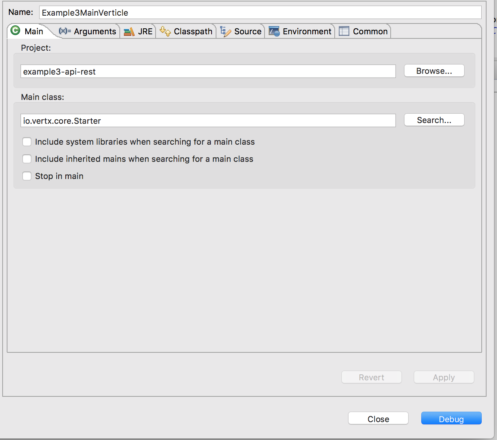
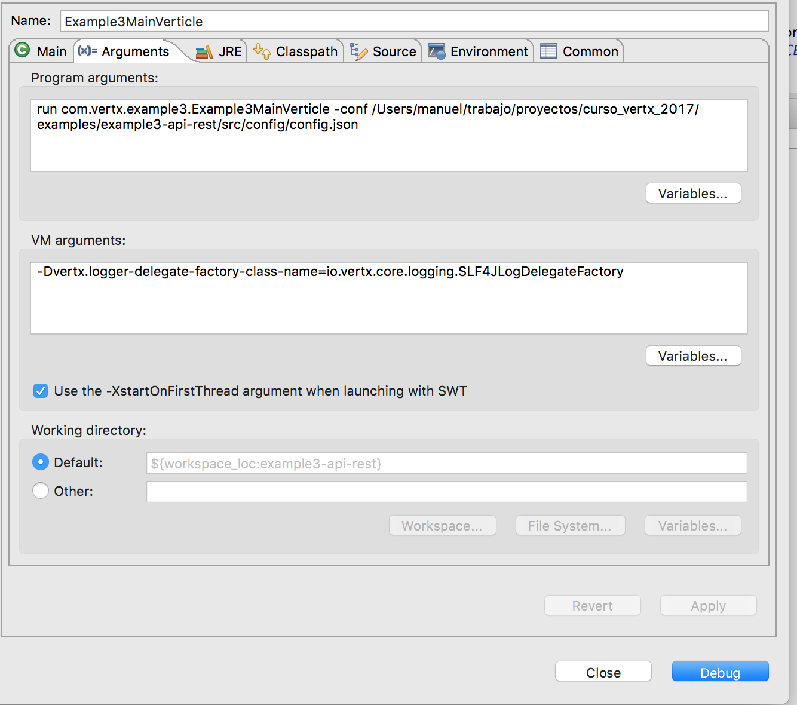

# Primer ejemplo de servidor http simple 

La finalidad será crear:

- Servidor http
- Servidor http + pequeño API REST

# En eclipse Ejecutar el Verticle que se quiera del siguiente modo:

 - Seleccionar la clase Starter
 - Añadir el comando run PAQUETERIA_Y_NOMBRE_DE_VERTICLE -conf ruta_al_fichero_de_configuracion
 - Añadir la variable de entorno de java  -Dvertx.logger-delegate-factory-class-name=io.vertx.core.logging.SLF4JLogDelegateFactory -Dhazelcast.logging.type=slf4j
 - Añadir la variable de entorno de java para el debug de -Dvertx.options.blockedThreadCheckInterval=1000000 

# Build and run 

Ejecutar build_and_run.sh
